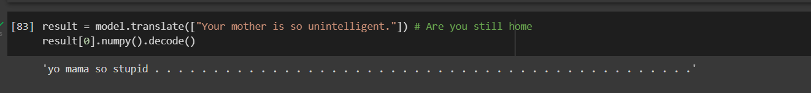

# README

# slang-translator

### Team members:

Anu Reddy : Anu.reddy@uni-heidelberg.de \
Shreyansu Vyas : rk305@stud.uni-heidelberg.de \

### Existing code fragments:

for meaning extraction of phrases, we might be using:

https://github.com/thatbrguy/Reverse-Dictionary

for emoji association, we draw insight from:

https://github.com/fabriceyhc/emoji_translate

https://github.com/anaulin/emoji-translator

### Utilized libraries:

For data processing&storage: Pandas, Elasticsearch

For language processing: nltk, gensim, spacy

See requirements.txt for further information.

### Project log (alphabetical order)

#### Contribution By AnuReddy:

Implementing python codes to process a csv and json file and save into elasticsearch.
In the next stage : development of api to communicate with frontend and backend

#### Contribution By Mani Smaran Nair:

Data visualization
In the next stage : Implementing the front interface and using the api developed by anureddy.(DROPPED OUT)

#### Contribution By Shreyansu Vyas:

Combining multiple datasets into one comprehensive file. (data cleaning)
creating frontend, refactoring, maintaining readme

#### Contribution By Yanxin Jia:

Written the project proposal, explored various methods for data utilization.
In the next stage : further model&algorithm implementation. (DROPPED OUT)

### Datasets Used (or will be utilizing):

https://github.com/muan/emojilib

https://www.kaggle.com/datasets/daphnakeidar/slangvolution?select=slang_2020_tweets.csv

https://www.kaggle.com/datasets/gowrishankarp/chat-slang-abbreviations-acronyms

https://www.kaggle.com/datasets/eliasdabbas/emoji-data-descriptions-codepoints

https://7esl.com/texting-abbreviations/

https://www.kaggle.com/datasets/therohk/urban-dictionary-words-dataset

## Project State

The project has been completed succesfully

### Future Planning

Quickly recall our task: to translate a formal input sentence into an informal Internet one possibility with emoji. Translation without bulky seq2seq models is difficult, but not impossible. The process of such a translation, on the other hand, would be heavily reliant on the quality and structure of our data. The datasets we now have can be described as 2 parts:

One major part of the data is raw twitter text data that would be used for word2vec training. Based on such a training, we would be able to build associations via vector distance among similar words in the Internet context. By utilizing these connections, one would be able to perform a meaning-reliant association for words that would fit into the input context by first extracting noun/verbs from the input sentence and then perform model.wv.most_similar with them. After obtaining associated words, we would perform ES query based on the obtained word list in the emoji dataset, which has multiple keywords for one single emoji, enabling association in a broader context. Append the associated emoji to (or substitute with) the original text, then the job of an emoji translation is done.

The other part of the datasets are mostly slang-related. We already have abbreviations and their original forms (see https://www.kaggle.com/datasets/gowrishankarp/chat-slang-abbreviations-acronyms), and slangs with their meanings explained (see https://www.kaggle.com/datasets/therohk/urban-dictionary-words-dataset). Based on the above data, for a translation into slang we might:

1. perform ES query with all possible k-shingle of the text and substitute some certain k-shingle with the corresponding (available) slang phrase. This is the easiest possible thing to implement, and since we already have the data ready, the query part would take little time. The remaining question is how to ensure accuracy of such queries, since the k-shingle and the explanation&translations we have for slangs can be phrased differently. The calculation of meaning similarity could be done using spacy built-ins, but its performance remains to be seen.

2. perform association for noun phrases in input sentence using ReverseDictionary (which would translate phrases into relevant single words), and perform queries with the obtained word list. Assign weights to these queries according to the relevancy of it (can be calculated with spacy) with the original phrase, and apply queried slangs with possibility calculated through weight value. This method can also be useful when it comes to emoji association.

Another major difference between informal&formal language is the grammar. There are large-scaled tools like grammarly for auto grammar correction. This would come into use if we are going to translate from informal text into formal ones, while parsing sentence structure according to grammar can also be applicable if we would want to for example remove the subject ("I am studying hard"->"am studying hard") to add some informal flavor when translating formal language into Internet language.

Implement the above mentioned pipeline should not take more than a week, and I would propose that the group finish a basic version of the project (with a functioning UI) before end of the year which is 12.31. While implementing there could also be timeline and stategy shifts due to precision of the proposed method.

This has been completed however, some part has not been integrated due to members dropping out.

### Architecture Description

We shall be splitting the functions drafted in translation_framework_draft.ipynb into multiple .py files which would function as the middle part between UI and ES. The aforementioned part would be stored in folder "middleware" while ES related codes would be stored separately in "Connection". We have not been tackling the UI part for now. The processing of data such as tokenization is implemented&commented alongside.

### Initial Experiments

We trained a basic word2vec model based on obtained twitter data (source: https://www.kaggle.com/datasets/daphnakeidar/slangvolution?select=slang_2020_tweets.csv) and tested its performance on multiple words. The results display obvious twitter bias due to the small size of the corpus, as it's "most_similar" include "Kanye" with "ghost" and "god" with "coward". But the first one of the most similar words extracted have displayed generally good accuracy. By increasing dataset size, we reasonably expect higher precision. See Test_word2vec.ipynb for details.

It is described in "future planning" how the (partial) translation should function based on current utilities. The process is drafted in translation_framework_draft.ipynb. It is not formed&tested and is only a frame for further implementation up to now.

### Data Analysis

**Data sources**: see dataset&API part of this documentation.

**Preprocessing**: the twitter data requires much cleaning before usage. See word2vec_model_formulation for details. The steps include:

1. removing hashtags and @s. This is done by converting string to list (with tokenization) and removing the word after # or @.
2. removing symbols that would not be useful for further processing. List the symbols and delete them from the tokenized list.
3. lowercase all words to decrease dimension of the data and validate the training.
4. extract emojis that cannot be correctly tokenized and tokenize them separately. Done with python library "emoji".

The input data to be translated should also require preprocessing for keyword extraction. There are two ways to extract keywords, one is to use spacy nlp().noun*chunks along with structure of verb phrases to extract all grammatical entity, another is to analyze the sentence structure with token.dep*. Both are feasible.

**Basic statistics**: see DataVisualization.ipynb.

### **Examples**: We will show one example from each dataset to display its structure. Dataset ordered as in list of links.

_"Slang_2020_tweets"_: .csv, {word_id, word, tweeter_id, year, month, day, text, author_id, #Unnamed:0}. "Text" is the tweet with slang word "word", while the last column denotes the freq for "word" in tweet text. For eg the first row:

{0,
AWOL,
1220362722015092741,
2020,
1,
23,
Chris Hayes Issues Ultimatum To GOP Senators Napping, Going AWOL From Trump Trial - Democratic Under...(tweet text),
55343543,
0.0,
}

_"Emojilib"_: .json, contains emojis and related keywords, example as:

{
'😀': [
'grinning_face',
'face',
'smile',
'happy',
'joy',
':D',
'grin'
],
'😃': [
'grinning_face_with_big_eyes',
'face',
'happy',
'joy',
'haha',
...
}

_"Chat / Internet Slang | Abbreviations | Acronyms"_: .json, contains abbreviations and their original forms, example as:

"root":{

"2day":string"today",

"2m2h":string"too much too handle",

...}

_"Full Emoji Database"_: .csv, {emoji, name, group, subgroup, codepoints}. Contains encoding and emoji type&definition. Example as:

{🙂, grinning face, Smileys & Emotion, face-smiling, 1F600}

_"Texting Abbreviations"_: not well-formed, HTML. Contain abbreviations and the original form, only for reference use alongside "Chat / Internet Slang | Abbreviations | Acronyms" dataset.

_"Urban Dictionary Words And Definitions"_: corpus of 2.6 million words with ratings from urban dictionary. Contains slang ID, slang, upvote for definition, downvote for definition, author of definition and definition. Could be outdated, and if so, we would use our own Urban Dictionary API for the same purpose.

Example as:

{ 0000007.
Janky,
296,
255,
dc397b2f,
Undesirable; less-than optimum.}

## 03.02.2023

The data we are using is GYAFC corpus, which is Grammarly’s Yahoo Answers Formality Corpus(which is the paired data) along with slang data and emoji dataset to get below desired output. The model that we used is Seqeunce to Seqeunce RNN model with attention. Running this model with vocabulary size of 12,000(appox) with 10 epochs gives around 40% accuracy.

The example shows the output that is shown after training.

## 22.02.2023
Created the whole pipeline with the docker file. A few indexes are created while the other are still pending.
Soon , we will have the results being printed on the frontend svelte.

## 03.03.2023
The project has been completed.
